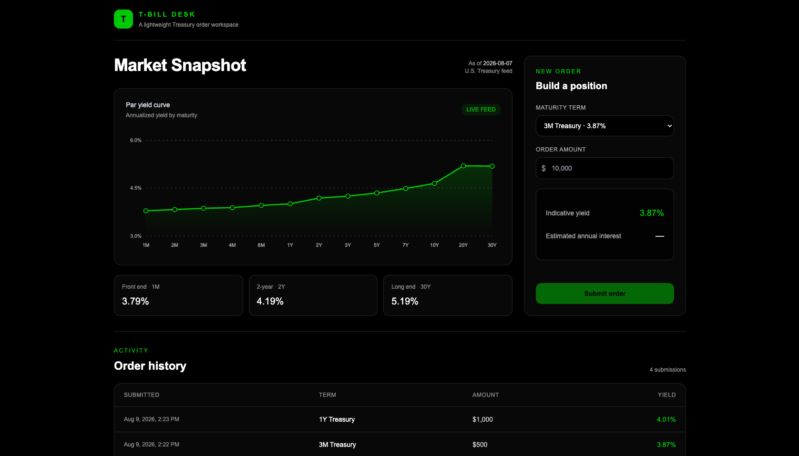

# T-Bill Desk



T-Bill Desk is a full-stack workspace for exploring the U.S. Treasury yield curve and submitting Treasury orders.
It fetches daily par yields from the official U.S. Treasury feed, plots maturities from 1 month through 30 years, and shows order history.

## Quick start

You only need Node.js 20 or newer and npm to run the app locally. Supabase is optional.

### 1. Clone and install

```bash
git clone https://github.com/mpaustin/t-bill-desk.git
cd t-bill-desk
npm install
```

### 2. Start the app (defaulted to port 3000)

```bash
npm run dev
```

### Running without Supabase

No environment file or Supabase account is required for local use. If Supabase is not configured, orders are saved in your browser's `localStorage` instead of a database. They remain available after restarting the Next.js server, as long as you use the same browser and URL.

Local storage is specific to each browser and origin. Clearing site data, using an incognito window, or switching between `localhost:3000`, `localhost:3001`, and `127.0.0.1:3000` creates a separate order history.

The app still fetches live Treasury data in this mode. If the Treasury feed is unavailable, it displays fallback market data so the order workflow remains available.

## Optional: Supabase persistence

Use Supabase if you want database-backed order history and anonymous user sessions. You can skip this section if browser-local persistence is sufficient.

### 1. Create a Supabase project

Create a project at [supabase.com/dashboard](https://supabase.com/dashboard). From the project’s **Settings → General** page, copy the project reference. You will also need the project URL, anon key, and service-role key from **Settings → API**.

### 2. Install and authenticate the Supabase CLI

The CLI is optional for the local-storage workflow. On macOS, install the native CLI with Homebrew:

```bash
brew install supabase/tap/supabase
supabase login
```

The login command opens a browser and asks you to confirm a verification code. Check that it worked:

```bash
supabase projects list
```

### Windows (PowerShell)

Install the CLI with [Scoop](https://scoop.sh/):

```powershell
Set-ExecutionPolicy -ExecutionPolicy RemoteSigned -Scope CurrentUser
irm get.scoop.sh | iex
scoop bucket add supabase https://github.com/supabase/scoop-bucket.git
scoop install supabase
supabase --version
```

Then run `supabase login` and complete the browser verification step described above.

If `npx supabase` reports an architecture or binary mismatch, use the native package-manager CLI for your platform instead. See the [official Supabase CLI installation guide](https://supabase.com/docs/guides/local-development/cli/getting-started) for other platforms.

### 3. Link the project and apply the schema

From the repository root:

```bash
export SUPABASE_PROJECT_REF=YOUR_PROJECT_REF
supabase link --project-ref "$SUPABASE_PROJECT_REF"
supabase config push --project-ref "$SUPABASE_PROJECT_REF"
supabase db push
```

These commands enable anonymous sign-ins and create the `public.orders` table with row-level security. The checked-in migration is at [`supabase/migrations/20260809074500_create_orders.sql`](./supabase/migrations/20260809074500_create_orders.sql), with equivalent SQL in [`supabase/schema.sql`](./supabase/schema.sql).

### 4. Add environment variables

Create `.env.local` in the repository root:

```bash
cp .env.example .env.local
```

Fill it with the values from **Settings → API**:

```env
NEXT_PUBLIC_SUPABASE_URL=https://YOUR_PROJECT_REF.supabase.co
NEXT_PUBLIC_SUPABASE_ANON_KEY=YOUR_ANON_KEY
SUPABASE_SERVICE_ROLE_KEY=YOUR_SERVICE_ROLE_KEY
```

Restart `npm run dev` after changing `.env.local`. Keep the service-role key server-only: never commit `.env.local`, put this key in a `NEXT_PUBLIC_` variable, or share it publicly.

When Supabase is configured, the app uses anonymous Supabase Auth and stores each user’s orders in the database. The browser session is retained across app restarts, but changing browsers or origins creates a different anonymous user.

## Useful commands

```bash
# Run the app
npm run dev

# Run API tests
npm test

# Run tests in watch mode
npm run test:watch

# Validate a production build
npm run build

# Supabase migration commands, after linking a project
supabase migration list --linked
supabase db push --dry-run
supabase db push
```

## Troubleshooting

### Orders are not showing

Use the same browser and exact URL that created the order. Without Supabase, order history is stored in browser local storage. With Supabase, anonymous sessions are also scoped to the browser origin.

### Supabase changes are not visible

Restart the Next.js process after editing `.env.local`:

```bash
npm run dev
```

### `supabase db push` mentions Docker

Docker is not required for the hosted Supabase workflow above. It is only needed for running the full Supabase stack locally with `supabase start`.

## Project structure

```text
app/page.tsx             Main dashboard and order flow
app/api/treasury         Treasury feed proxy and fallback
app/api/orders           Supabase-backed order API
components/yield-chart   Lightweight SVG curve chart
lib/treasury.ts          Feed URL, parser, and fallback curve
supabase/config.toml     Supabase CLI and Auth configuration
supabase/migrations      Versioned database migrations
supabase/schema.sql      SQL equivalent of the orders schema
```

## Why Next.js and TypeScript?

Next.js lets the app keep its React interface and backend API routes in one repository. The API routes centralize Treasury data fetching, fallback handling, order validation, and Supabase access without requiring a separate server. It also provides a straightforward path to authentication, testing, and production deployment if the app grows.

TypeScript adds shared types for yield curves and orders, catching data mismatches during development and making the API and UI contracts easier to understand.

Supabase provides a quick way to add a hosted Postgres database and authentication. Anonymous Auth lets users submit orders without creating an account for the demo workflow, while the platform provides a straightforward path to persistent user accounts and higher-scale usage in the future.

## Future considerations

If the app were taken further, potential next steps would include:

1. Implement actual user accounts and authentication in place of anonymous user sessions.
2. Cache fetched Treasury yields for each business day since they do not change intraday.
3. Calculate and store daily interest earned on executed orders, then display it in the UI.
4. Track cumulative amount invested and weighted APY.
5. Display term progress for each order.
6. Connect to a brokerage for executing actual orders rather than only submitting them through this app.
7. Add broader test coverage, including UI tests.
8. Host and deploy the app for production use.
